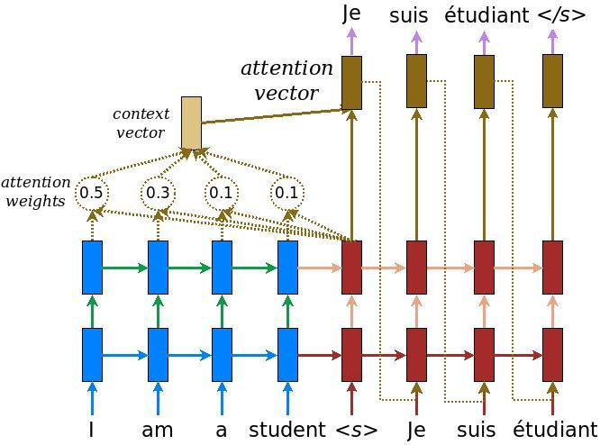

####  [Sequence Models](https://dujm.github.io/DS_Sequence_Models/)   |      [Attention Model](https://dujm.github.io/DS_Sequence_Models/attention-model)    |    [Word Embeddings](https://dujm.github.io/DS_Sequence_Models/word-embeddings)    |    [More about Data Science](https://dujm.github.io/pages/datascience.html)

### 1. What is attention?
  * [Attention](https://medium.com/syncedreview/a-brief-overview-of-attention-mechanism-13c578ba9129) is a vector, often the outputs of dense layer using softmax function.

### 2. What is an attention model?  
  * The [attention model](https://medium.com/syncedreview/a-brief-overview-of-attention-mechanism-13c578ba9129) plugs **a context vector** into the gap between encoder and decoder.

  * According to the schematic below, blue represents encoder and red represents decoder

  * The context vector takes all cells’ outputs as input to compute the probability distribution of source language words for each single word decoder wants to generate.

[Image Source](https://medium.com/syncedreview/a-brief-overview-of-attention-mechanism-13c578ba9129)
 

### 3. Why do we use attention model?
  * Attention model allows machine translator to look over all the information the original sentence holds, then generate the proper word according to current word it works on and the context.

  * It can even allow translator to zoom in or out (focus on local or global features).

  * By utilizing attention model, it is possible for decoder to capture somewhat global information rather than solely to infer based on one hidden state.
   

### 4. How to solve a Human-Machine Translation problem using a attention-based bidirectional LSTM?  
  * Try the Human-Machine Translation exercise on Coursera  
(Translating human readable dates into machine readable dates)  
[Coursera notebook](https://www.coursera.org/learn/nlp-sequence-models/notebook/npjGi/neural-machine-translation-with-attention)  

  * Take a look at [my notebook](https://github.com/dujm/DS_Sequence_Models/blob/master/notebooks/Finished/w3_Neural_machine_translation_with_attentionv4_DJ.ipynb)  
(Images need to be added)

 
---
### Read more?
  * [A Brief Overview of Attention Mechanism, Medium](https://medium.com/syncedreview/a-brief-overview-of-attention-mechanism-13c578ba9129)

  * [How Does Attention Work in Encoder-Decoder Recurrent Neural Networks](https://machinelearningmastery.com/how-does-attention-work-in-encoder-decoder-recurrent-neural-networks/)
