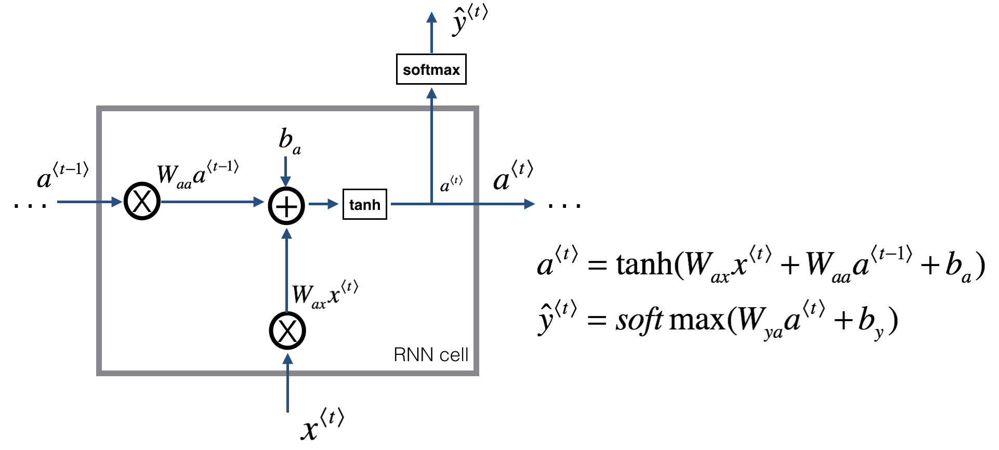

### Sequence Models

### I: Recurrent Neural Networks

 

#### 1.What are some examples of sequence data?
* DNA/RNA/Protein Sequence
* [Smart home](https://www.youtube.com/watch?v=d4Sn6ny_5LI)
* Stock change
* Supply chain
* Music generation
* Speeach recognition
* Sentiment classification
* Video activity recognition
* Name entity recognition (one example here)
  * Representing Words
    * Words Index xT, yT  
  * Dictionary :  
    * Big company use 1 million words  
    * Commercial: 30k    
    * This lecture example: 10k  
    * One-Hot encoders
    

#### 2. Why don't we use a standard network for sequence data analysis?

Problems:

* Input and outputs can be different lenths in different sentences
* You may pad or zero-pad each inputs up to that maximum length
* Don't share features learned across different positions of text
* Huge matrix: each vector xT * max No. of words

    

#### 3. How does a (uni-directional) recurrent neural network different from a standard network?

* To kick off, add a made-up activation at time 0
  * Usually the vectors of zeros as the fake times zero activation)
  * Or intialize a0 randomly
* Reads the 1st word in a sentence, predict whether the word is a part of the name y1 for X1
* Reads the 2nd word in a sentence, predict y2 for X2
* Passes the activation information from time step 1 to time step 2  

 

     

     

 By Andrew NG

  
#### 4. Vanishing gradients with RNNs

  * Exploding gradients:

      * Parameters get large

      * Gradient Clipping: when you derivatives explode or you see NaNs, then rescale numerical vectors. This is a very robust way.

  * Vanishing gradients:
    * Harder to solve
    * GRU

      

#### 5. What are forward propagation and backward propagation?

* Forward Propagation
* Backward propagation through time
* [The Unreasonable Effectiveness of Recurrent Neural Networks][1]

  

#### 6. Bidrectional Neural Networks (BRNNs)

#### Activation Functions:

##### Hidden Layers:

* Relu

  * [If a lot of neurons die](https://www.youtube.com/watch?v=-7scQpJT7uo )
    * Leaky Relu
    * MaxOut

* Don't use:

  * Sigmoid
    * Gradient vanishing problems
    * Loss of control because it's not 0-centered (all +)
  * Tanh (Hyperbolic Tangent Function)
    * Gradient vanishing problems

##### Output layers

* Softmax: For classification

* Linear function: For regression
##### Note:

* For a real type speech recognition applications: complex modules.
* NLP processing applications: use standard BRNN when you can get the entire sentence all the same time
      

#### 7.Deep BRNNs
* You don't see a lot of deep-connected layers because of the large temporal dimensions
* 3 layers is already deep  
    

#### 8. Language modelling and sequence generation

* A trining set comprising a large corpus of text
* Tokenization
  * End of Sentence (EOS)
  * Unkown words (UNK)
* Vocabulary-level language model
* Character-level language model
  * punctuations and space are also vectorss
  * Don't need to worry about UNK, assign non-zero vectors
  * Not good at capturing long-range word dependencies
  * How about Chinese and German?
* Sequence generation

    

#### 9. Gated Recurrent Unit (GRU)
* What is GRU? [GRU] [2] is a modification of the RNN hidden layer

* Why GRU? GRU is much better [capturing long range connections] [3] and helps a lot with the vanishing gradient problems.
#### What is a common GRU composed of?
* Memory Cell Value (c): a new variable in GRU

  * Provide a bit of memory to remember

  * E.g. The dog, which already ate a sausage, was full.

  * The c will remember whether the subject of the sentence, "dog", was singular or plural, so that when it gets much further into the sentence it can

  * For GRU, ct = at (output activation)

* The optic gate

  * Notion: capital Greek alphabet gamma Γu

  * The job of the Gate, gamma u: to decide when do you update the value ct

  * [0 -1] For intuition, think of gamma as either 0 or 1

* The relavence gate

  * Notion: Γr

  
#### 10. Long Short-Term Memory (LSTM) network
##### What is a LSTM unit and network?
Long short-term memory (LSTM) units are units of a RNN. An RNN composed of LSTM units is often called an [LSTM network](https://en.wikipedia.org/wiki/Long_short-term_memory).

##### What is a common LSTM composed of?
* a cell
* an input gate
* an output gate
* a forget gate.
##### How does LSTM work?
* Forget gate: LSTM should remove that piece of information (e.g. the singular subject) in the corresponding component. If one of the values is 1, then it will keep the information.
* Update gate: Once we forget that the subject being discussed is singular, we need to find a way to update it to reflect that the new subject is now plural.
* Updating the cell: To update the new subject we need to create a new vector of numbers that we can add to our previous cell state.
* Output gate: To decide which outputs we will use

     
     By Andrew NG  
  

#### 11. Read more?

##### [Understanding LSTM Networks | GitHub](http://colah.github.io/posts/2015-08-Understanding-LSTMs/)  

##### [The Illustrated BERT, ELMo](http://jalammar.github.io/illustrated-bert/)

##### [BERT Explained: State of the art language model for NLP | Medium](https://towardsdatascience.com/bert-explained-state-of-the-art-language-model-for-nlp-f8b21a9b6270)

---
[//]: # (How to print y hat in markdown?)

 [1]: http://karpathy.github.io/2015/05/21/rnn-effectiveness/ "The Unreasonable Effectiveness of Recurrent Neural Networks"

 [2]: https://arxiv.org/abs/1409.1259/ "Cho et al., 2014. On the properties of neural machine translation: Encoder-decoder approaches"
 [3]: https://arxiv.org/abs/1412.3555/ "Chung et al., 2014. Empirical Evaluation of Gated Recurrent Neural Networks on Sequence Modeling"
